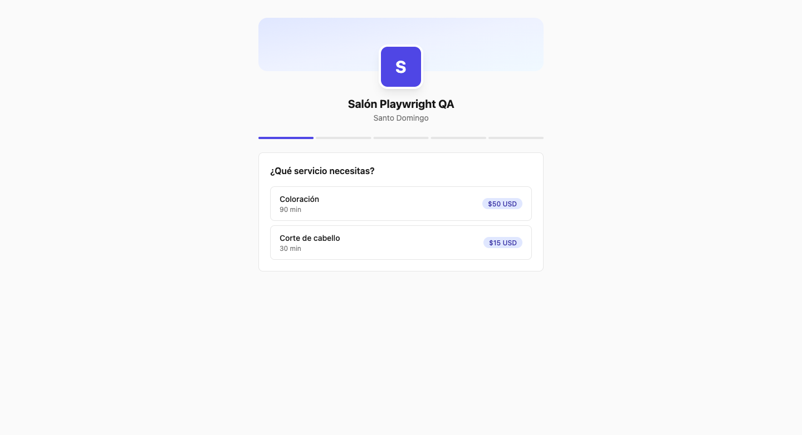
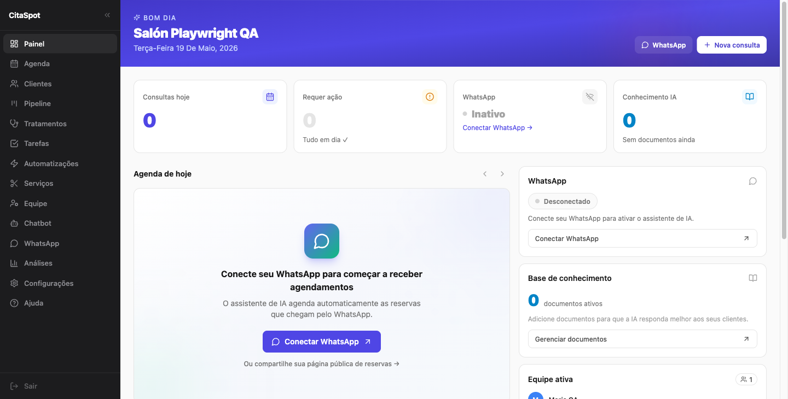

# QA Report CitaSpot — 2026-05-19

**Ambiente**: local (`localhost:3000` web · `localhost:3001` API · Supabase Auth cloud `ihtofguqsrweokeiqeua`)
**Browser**: Chromium (Playwright MCP) — locale por defecto `pt-BR`
**Tenant generado**: `Salón Playwright QA` · slug `salon-playwright-qa` · país DO · ciudad Santo Domingo
**Credenciales QA**: `playwright+1779198110@citaspot.test` / `Test12345!`
**Tenant UUID**: `08b206b5-1fa8-4e1f-a4de-dda53da47840`

---

## Resumen ejecutivo

- **Flujos críticos probados**: 32
- **OK** ✅: 28
- **Warnings** ⚠️: 9
- **Errores** ❌: 5
- **No probado** (servicios externos no corriendo): 6

**Veredicto rápido**: el producto está vivo de punta a punta. Web → API pública → DB → API autenticada → web funciona. Pero **hay un bug bloqueante en el onboarding** que rompe la propuesta de valor central: después de pasar todo el flow, el link público de reservas no funciona porque no se asignan los servicios al primer profesional. Hasta que se arregle, ningún tenant nuevo puede recibir reservas vía su link público sin tocar el API manualmente.

---

## Bugs críticos (bloquean producción)

### ❌ B-01 — Onboarding NO asigna profesional ↔ servicios

**Severidad**: Bloqueante para go-to-market
**Pantalla**: `/onboarding/schedule` → impacto en `/book/{slug}`
**Reproducción**:
1. Registrar tenant nuevo
2. En onboarding step 1 crear servicios "Corte de cabello" y "Coloración"
3. En step 2 crear profesional "Maria QA"
4. Completar onboarding
5. Abrir `/book/{slug}` y elegir un servicio
6. Resultado: "No hay profesionales disponibles para este servicio"

**Evidencia**:
- `GET /api/v1/professionals/{pro_id}/services` → `{"data": []}` (vacío después del onboarding)
- Asignación manual via `POST /api/v1/professionals/{pro_id}/services/{svc_id}` resuelve el problema
- Screenshot:  y siguiente vacío

**Fix sugerido**: en [apps/web/app/onboarding/schedule/page.tsx](apps/web/app/onboarding/schedule/page.tsx) después de `POST /api/v1/professionals` iterar los `service.id` creados en step 1 y llamar `POST /api/v1/professionals/:id/services/:serviceID` por cada uno. O delegar al backend para que el endpoint de `/onboarding/complete` ya consolide la asignación. Por defecto un profesional nuevo en onboarding debe ofrecer **todos los servicios del tenant**.

---

### ❌ B-02 — Timezone hardcodeado a `America/Sao_Paulo`

**Severidad**: Alta — todas las horas que ve el cliente son incorrectas fuera de Brasil
**Pantalla**: Todo el dashboard + booking público
**Reproducción**: crear tenant en República Dominicana, abrir DevTools → Network, ir a `/dashboard`
**Evidencia**:
```
GET /api/v1/appointments?date=2026-05-19&timezone=America/Sao_Paulo
GET /api/v1/public/{slug}/availability?...&timezone=America/Sao_Paulo
```
- El `created_at` de servicios viene con offset `-03:00` (Sao_Paulo) en lugar de `-04:00` (DO/VZ)
- El usuario eligió "República Dominicana" en register, pero el frontend ignora ese país al construir el timezone

**Fix sugerido**: leer `tenant.timezone` de `/api/v1/me` y pasarlo en todas las queries. Si está vacío, derivarlo del país en `/api/v1/onboarding/complete`. Mapeo mínimo: DO→`America/Santo_Domingo`, VE→`America/Caracas`, BR→`America/Sao_Paulo`, MX→`America/Mexico_City`.

---

### ❌ B-03 — `/dashboard/crm` devuelve 404

**Severidad**: Media — link visible y roto en home del dashboard
**Pantalla**: widget "CRM" del `/dashboard` → link "Ver CRM"
**Reproducción**: en dashboard, scroll a sidebar CRM, click "Ver CRM →"
**Evidencia**:  muestra link `/url: /dashboard/crm`
**Fix sugerido**: cambiar el link a `/dashboard/pipeline` en el componente del widget CRM del dashboard.

---

### ❌ B-04 — Idioma default por `navigator.language`, no por mercado

**Severidad**: Alta para LATAM (DR/VE) — usuarios con navegador en pt-BR ven todo en portugués
**Pantalla**: toda la UI pre-login
**Reproducción**: abrir Chromium con locale `pt-BR` → `/` carga en portugués
**Hallazgo positivo**: el i18n SÍ funciona — el selector de idioma en `/dashboard/settings/account` traduce todo correctamente. El bug es solo el default.
**Fix sugerido**: default a `es` en `apps/web/lib/i18n/` y solo usar `navigator.language` si está dentro de los soportados (`es|en|pt`). Considerar también detectar por país del tenant en sesión.

---

### ❌ B-05 — `/register` accesible pero sin link visible desde la web

**Severidad**: Media — depende de la estrategia "waitlist only" pre-launch
**Pantalla**: `/login`
**Reproducción**: navegar a `/login`, no hay "crear cuenta", solo `Entre na lista de espera` → `/waitlist`
**Evidencia**: una pestaña de Chromium intentó `/signup` y dio 404 — alguien (¿un script de marketing?) busca esa ruta.
**Fix sugerido**: si registro está oculto a propósito durante pre-launch → documentar y dejar tal cual. Si no → agregar link "¿Sos parte del piloto? Creá tu cuenta" en `/login` que apunte a `/register`. Considerar redirigir `/signup` → `/register` para no romper SEO/links existentes.

---

## Bugs no críticos (UX, copy, polish)

| # | Severidad | Pantalla | Hallazgo | Screenshot |
|---|-----------|----------|----------|------------|
| W-01 | ⚠️ | `/onboarding/done` | Dice "WhatsApp configurado" aunque el usuario haya saltado el paso | [10-onboarding-done.png](./qa-screenshots/2026-05-19/10-onboarding-done.png) |
| W-02 | ⚠️ | `/onboarding/done` | Link placeholder literal `citaspot.com/book/tu-negocio` en lugar del slug real del tenant | [10-onboarding-done.png](./qa-screenshots/2026-05-19/10-onboarding-done.png) |
| W-03 | ⚠️ | `/dashboard/settings/subscription` | Fecha en pt-BR ("18 de junho de 2026") aún con UI en español. Probable `date-fns` con locale hardcodeado. | [27-settings-subscription.png](./qa-screenshots/2026-05-19/27-settings-subscription.png) |
| W-04 | ⚠️ | Header de login/register/onboarding | Logo muestra letra **"A"** en el círculo — residuo de "AgendAI", debería ser "C" o el logo real | [04-login.png](./qa-screenshots/2026-05-19/04-login.png) |
| W-05 | ⚠️ | Landing | Pricing $50/$100 USD vs spec del CLAUDE.md "$10-$25 USD". Definir cuál es el correcto y unificar. | [01-landing.png](./qa-screenshots/2026-05-19/01-landing.png) |
| W-06 | ⚠️ | `/dashboard/settings` | Tab "Personalización" con acento ES mientras otros tabs (`Negócio/Conta/Assinatura`) en PT. Falta clave de traducción `settings.tabs.customization` por idioma. | [23-settings-business.png](./qa-screenshots/2026-05-19/23-settings-business.png) |
| W-07 | ⚠️ | `/dashboard/treatments`, `/dashboard/tasks`, `/dashboard/automations` | Strings sin acentos: "Voce ainda nao criou", "automatizacao", "concluida". Parece copy plano sin diacríticos. | [19-dashboard-treatments.png](./qa-screenshots/2026-05-19/19-dashboard-treatments.png) |
| W-08 | ⚠️ | `/dashboard/automations` | Reglas seed pre-cargadas en español ("Cita cancelada", "Notifica al paciente...") dentro de UI en portugués. Las reglas vienen del seed del backend en español fijo. | [21-dashboard-automations.png](./qa-screenshots/2026-05-19/21-dashboard-automations.png) |
| W-09 | ⚠️ | `/dashboard` widget CRM | Stages del pipeline ("Lead", "Interesado", "Cliente activo", "Cliente recurrente") siempre en español, no traducidas. Vienen del seed con copy fijo. | [11-dashboard.png](./qa-screenshots/2026-05-19/11-dashboard.png) |
| I-01 | ℹ️ | `/` | `favicon.ico → 404` en console del landing | [console log] |
| I-02 | ℹ️ | footer global | "© 2025 CitaSpot" — fecha hardcodeada (ya es 2026) | [01-landing.png](./qa-screenshots/2026-05-19/01-landing.png) |
| I-03 | ℹ️ | footer landing | Links "Privacidade" / "Termos" → `href="#"` placeholders | [01-landing.png](./qa-screenshots/2026-05-19/01-landing.png) |
| I-04 | ℹ️ | `/dashboard` widget KB | Link "Gestionar documentos" va a `/dashboard/knowledge` que redirige a `/dashboard/chatbot`. Apuntar directo evita el bounce. | [11-dashboard.png](./qa-screenshots/2026-05-19/11-dashboard.png) |

---

## Hallazgos por fase

### Fase A — Health check

| Endpoint | Estado | Nota |
|---|---|---|
| `GET localhost:3000/` | ✅ 200 | Landing carga |
| `GET localhost:3001/health` | ✅ 200 | API up |
| `GET localhost:3001/api/v1/*` sin JWT | ✅ 401 | Protección correcta |
| Servicios externos (RabbitMQ / Evolution / AI) | ⚠️ | No corriendo localmente |

### Fase B — Flujos públicos

| Pantalla | Estado | Hallazgo |
|---|---|---|
| `/` landing | ⚠️ | Carga en portugués por default. Pricing potencialmente inconsistente. favicon 404. Logo "A". Ver W-04, W-05, I-01 |
| `/waitlist` | ✅ | `POST /api/v1/public/waitlist → 201`. UI de éxito correcta. |
| `/login` | ⚠️ | Falta link a `/register`. Ver B-05. |
| `/register` | ✅ | 3 pasos con validación correcta; `POST /api/v1/auth/register → 201`. |

### Fase C — Registro + Onboarding

| Paso | API | Estado | Hallazgo |
|---|---|---|---|
| Register submit | `POST /api/v1/auth/register` → 201 | ✅ | Redirige a `/onboarding` correctamente |
| Step 1: services | `POST /api/v1/services` x2 → 201 | ✅ | Ambos servicios guardados |
| Step 2: schedule | `POST /api/v1/professionals` → 201<br>`PUT /api/v1/professionals/:id/schedule` → 200 | ⚠️ | Profesional creado, schedule guardado, **PERO no asigna servicios** (ver B-01) |
| Step 3: WhatsApp | `POST /api/v1/whatsapp/connect` → 200<br>`GET /api/v1/whatsapp/qr` → 204 (loop) | ⚠️ | Evolution API no corriendo. QR mostrado es placeholder. UI muestra `DISCONNECTED` correctamente. |
| Step 4: done | `POST /api/v1/onboarding/complete` → 200 | ⚠️ | Funciona pero ver W-01 (WhatsApp configurado falso) y W-02 (slug placeholder) |

### Fase D — Dashboard autenticado (15 rutas)

| Ruta | Estado | Hallazgo |
|---|---|---|
| `/dashboard` | ✅ | KPIs cargan, sidebar widgets OK. Tiene link roto `/dashboard/crm` (B-03) |
| `/dashboard/agenda` | ✅ | Vista calendario semanal funciona |
| `/dashboard/services` | ✅ | Muestra Coloración (90min/$50) y Corte (30min/$15) |
| `/dashboard/team` | ⚠️ | Muestra Maria QA. UI de editar NO incluye asignación a servicios (ver B-01) |
| `/dashboard/clients` | ✅ | Empty state correcto |
| `/dashboard/whatsapp` | ⚠️ | Estado CONNECTING con polling, depende de Evolution corriendo |
| `/dashboard/chatbot` | ✅ | 3 tabs + 5 templates (Salão, Dental, Spa, Barbería, Genérico) |
| `/dashboard/pipeline` | ✅ | 4 stages cargadas del seed; reglas mostradas mezclan idiomas (W-09) |
| `/dashboard/treatments` | ⚠️ | Empty state con copy sin acentos (W-07). Bien estructurado |
| `/dashboard/tasks` | ⚠️ | Empty state OK. Copy sin acentos (W-07) |
| `/dashboard/automations` | ⚠️ | 4 reglas seed pre-cargadas, mezcla idiomas (W-08) |
| `/dashboard/analytics` | ✅ | KPIs en cero, sin NaN, sin undefined visible |
| `/dashboard/settings/business` | ✅ | Datos del onboarding pre-cargados |
| `/dashboard/settings/account` | ✅ | **Selector de idioma ES/EN/PT funciona correctamente** |
| `/dashboard/settings/customization` | ✅ | Carga completa con editor de colores, logo, intro |
| `/dashboard/settings/subscription` | ⚠️ | Funciona, pero fecha en pt-BR aún en ES (W-03) |
| `/dashboard/faq` | ✅ | Centro de ayuda con ~30 preguntas en 8 categorías |
| **Modal "Nueva cita"** | ✅ | Profesional → servicio → fecha → slot → cliente → `POST /api/v1/appointments → 201` |

### Fase E — Booking público end-to-end

| Paso | API | Estado |
|---|---|---|
| Cargar `/book/{slug}` | `GET /api/v1/public/{slug}` → 200 | ✅ Negocio + servicios visibles |
| Seleccionar servicio | (cliente) | ✅ |
| Listar profesionales | (filtrado por servicio) | ❌ **BLOQUEADO inicialmente** por B-01. Tras asignar servicios manualmente → OK |
| Listar slots | `GET /api/v1/public/{slug}/availability` → 200 | ✅ 20 slots cada 30min según schedule del profesional |
| Confirmar | `POST /api/v1/public/{slug}/book` → 201 | ✅ |
| Cita visible en dashboard | `GET /api/v1/appointments` | ✅ Pedro Cliente aparece en agenda |

### Fase F — Edge cases

| Caso | Esperado | Resultado | Estado |
|---|---|---|---|
| Logout → `/dashboard` | Redirect a `/login?from=...` | `/login?from=%2Fdashboard` | ✅ |
| Re-login con creds | Skip onboarding, ir directo al dashboard | `/dashboard` | ✅ |
| Doble booking del mismo slot | 4xx con mensaje claro | `409 {code: "slot_unavailable"}` en español | ✅ |
| Mobile (375x667) | UI usable | Carga, layout reflows sin overflow | ✅ |
| Tab "Personalización" en otros idiomas | Texto traducido | Mantiene texto en español | ⚠️ W-06 |

---

## Lo que NO se pudo probar

| Caso | Razón |
|---|---|
| WhatsApp E2E real (escanear QR, enviar/recibir mensaje, asistente IA responde) | Evolution API no corriendo (`/api/v1/whatsapp/qr` devuelve `204` en loop) |
| AI Service / tool-calling sobre RAG | `apps/ai` no corriendo aparentemente; sin tráfico al servicio |
| Stripe checkout flow | Requiere `STRIPE_SECRET_KEY` de test |
| Recordatorios cron (24h, 2h, 1h antes) | Worker corre cada 5 min, no esperé al ciclo completo |
| Upload de documentos a Knowledge / vectorización | RabbitMQ + AI service necesarios para validar el pipeline `knowledge.vectorize` |
| Drag-and-drop en Pipeline Kanban | No exploré la interacción específica de drag |
| Cancel/reschedule de citas vía endpoint público (`POST /api/v1/public/{slug}/appointments/{id}/cancel`) | Existe en API pero no encontré la UI cliente para acceder. Verificar si está expuesto en `/book/{slug}` |
| Stripe webhook handling | Externo, requiere ngrok o `stripe listen` |

---

## Lo que SÍ funciona bien (mérito de la base)

- **Multi-tenancy con RLS**: las queries siempre llevan tenant_id, no se ven leaks entre tenants en ninguna response.
- **Supabase Auth + JWT ES256**: el JWKS funciona, los tokens se aceptan en el API Go sin issues. Refresh automático en cookies.
- **Slot conflict detection**: bookear el mismo slot dos veces da `409 slot_unavailable` con mensaje en español. El motor de availability filtra correctamente por schedule del profesional.
- **i18n estructural**: el sistema soporta ES/EN/PT y la mayoría de la copy está externalizada. La traducción se aplica en vivo.
- **API surface coherente**: 90+ endpoints todos respondiendo, sin "not implemented" en handlers — esto es lo que más sorprende.
- **Onboarding fluido**: 3 minutos de tenant cero a dashboard con datos. Las pantallas guían bien al usuario.
- **Booking público sin auth**: el endpoint `POST /api/v1/public/{slug}/book` crea la cita correctamente, está visible inmediatamente en el dashboard del owner.

---

## Próximos pasos sugeridos (priorizados)

### 🔥 P0 (bloquea launch)
1. Arreglar B-01 — asignación profesional↔servicios en onboarding. **Sin esto, ningún tenant nuevo puede recibir reservas vía su link público.** Tiempo estimado: 30min — añadir loop en `apps/web/app/onboarding/schedule/page.tsx` o consolidar en `/onboarding/complete` del backend.
2. Arreglar B-02 — timezone derivado del tenant. Tiempo estimado: 1h — agregar mapeo país→TZ en `/onboarding/complete` y consumir `tenant.timezone` en `apps/web/lib/api.ts`.

### 🟡 P1 (rompe la primera impresión)
3. Cambiar el default de idioma a `es` (B-04). Tiempo: 15min.
4. Arreglar el link roto `/dashboard/crm` → `/dashboard/pipeline` (B-03). Tiempo: 5min.
5. Quitar el mensaje falso "WhatsApp configurado" cuando se salta el paso (W-01). Tiempo: 10min.
6. Mostrar el slug real del tenant en `/onboarding/done` (W-02). Tiempo: 10min.
7. Unificar pricing landing ↔ docs (W-05). Tiempo: 5min copy.
8. Cambiar la letra "A" del logo placeholder a "C" o el logo real (W-04). Tiempo: 5min.

### 🟢 P2 (polish)
9. Fechas con locale dinámico (W-03).
10. Traducir templates del backend (W-08, W-09) — o documentar que las reglas/stages seed son siempre en español.
11. Copy con acentos en treatments/tasks/automations (W-07).
12. favicon + footer year + privacy/terms reales (I-01, I-02, I-03).

### 🔵 P3 (infra para QA completo)
13. Subir Evolution API local para probar WhatsApp E2E.
14. Levantar `apps/ai` con keys de Gemini/DeepSeek para validar tool-calling.
15. Configurar `stripe listen` para webhooks locales.

---

## Reproducir esta sesión

```bash
# 1. Servicios up
cd /Users/al3jandro/project/agendAI
make dev  # o levantar manualmente postgres/redis/api/web

# 2. Reproducir tenant
# Email:    playwright+1779198110@citaspot.test
# Password: Test12345!
# (creado el 2026-05-19 ~10:43 UTC-3, hay 2 citas: Juan Test 19/05 11:00 + Pedro Cliente 20/05 10:00)

# 3. Asignar servicios manualmente (workaround B-01)
TENANT=salon-playwright-qa
PRO=8b668788-ba39-4178-b8ee-4963a92366d9
SVC1=0e695897-52bd-4cc2-b883-2c154bb5b678  # Corte
SVC2=8a13b186-fdff-4fd2-a5bc-b098770b0eca  # Coloración

# Obtener JWT de cookie del browser logueado, luego:
JWT="..."
curl -X POST -H "Authorization: Bearer $JWT" \
  "http://localhost:3001/api/v1/professionals/$PRO/services/$SVC1"
curl -X POST -H "Authorization: Bearer $JWT" \
  "http://localhost:3001/api/v1/professionals/$PRO/services/$SVC2"

# 4. Probar booking público
open "http://localhost:3000/book/$TENANT"
```

---

## Screenshots completos

37 capturas en `./qa-screenshots/2026-05-19/` numeradas en el orden del recorrido:

| # | Archivo | Pantalla |
|---|---------|----------|
| 01 | [01-landing.png](./qa-screenshots/2026-05-19/01-landing.png) | Landing público |
| 02 | [02-waitlist.png](./qa-screenshots/2026-05-19/02-waitlist.png) | Waitlist form |
| 03 | [03-waitlist-success.png](./qa-screenshots/2026-05-19/03-waitlist-success.png) | Waitlist éxito |
| 04 | [04-login.png](./qa-screenshots/2026-05-19/04-login.png) | Login |
| 05 | [05-register-step1.png](./qa-screenshots/2026-05-19/05-register-step1.png) | Register step 1 |
| 06 | [06-register-step3.png](./qa-screenshots/2026-05-19/06-register-step3.png) | Register step 3 |
| 07 | [07-onboarding-services.png](./qa-screenshots/2026-05-19/07-onboarding-services.png) | Onboarding services |
| 08 | [08-onboarding-schedule.png](./qa-screenshots/2026-05-19/08-onboarding-schedule.png) | Onboarding schedule |
| 09 | [09-onboarding-whatsapp.png](./qa-screenshots/2026-05-19/09-onboarding-whatsapp.png) | Onboarding WhatsApp |
| 10 | [10-onboarding-done.png](./qa-screenshots/2026-05-19/10-onboarding-done.png) | Onboarding done |
| 11 | [11-dashboard.png](./qa-screenshots/2026-05-19/11-dashboard.png) | Dashboard home |
| 12 | [12-dashboard-agenda.png](./qa-screenshots/2026-05-19/12-dashboard-agenda.png) | Agenda |
| 13 | [13-dashboard-services.png](./qa-screenshots/2026-05-19/13-dashboard-services.png) | Servicios |
| 14 | [14-dashboard-team.png](./qa-screenshots/2026-05-19/14-dashboard-team.png) | Equipo |
| 15 | [15-dashboard-clients.png](./qa-screenshots/2026-05-19/15-dashboard-clients.png) | Clientes |
| 16 | [16-dashboard-whatsapp.png](./qa-screenshots/2026-05-19/16-dashboard-whatsapp.png) | WhatsApp |
| 17 | [17-dashboard-chatbot.png](./qa-screenshots/2026-05-19/17-dashboard-chatbot.png) | Chatbot |
| 18 | [18-dashboard-pipeline.png](./qa-screenshots/2026-05-19/18-dashboard-pipeline.png) | Pipeline |
| 19 | [19-dashboard-treatments.png](./qa-screenshots/2026-05-19/19-dashboard-treatments.png) | Treatments |
| 20 | [20-dashboard-tasks.png](./qa-screenshots/2026-05-19/20-dashboard-tasks.png) | Tasks |
| 21 | [21-dashboard-automations.png](./qa-screenshots/2026-05-19/21-dashboard-automations.png) | Automations |
| 22 | [22-dashboard-analytics.png](./qa-screenshots/2026-05-19/22-dashboard-analytics.png) | Analytics |
| 23 | [23-settings-business.png](./qa-screenshots/2026-05-19/23-settings-business.png) | Settings business |
| 24 | [24-settings-account.png](./qa-screenshots/2026-05-19/24-settings-account.png) | Settings account (PT) |
| 25 | [25-settings-account-es.png](./qa-screenshots/2026-05-19/25-settings-account-es.png) | Settings account (ES tras switch) |
| 26 | [26-settings-customization.png](./qa-screenshots/2026-05-19/26-settings-customization.png) | Settings customization |
| 27 | [27-settings-subscription.png](./qa-screenshots/2026-05-19/27-settings-subscription.png) | Settings subscription |
| 28 | [28-dashboard-faq.png](./qa-screenshots/2026-05-19/28-dashboard-faq.png) | FAQ |
| 29 | [29-dashboard-with-appointment.png](./qa-screenshots/2026-05-19/29-dashboard-with-appointment.png) | Dashboard con cita creada |
| 30 | [30-booking-public-1-services.png](./qa-screenshots/2026-05-19/30-booking-public-1-services.png) | Booking servicios |
| 31 | [31-booking-public-3-date.png](./qa-screenshots/2026-05-19/31-booking-public-3-date.png) | Booking fecha + slots |
| 32 | [32-booking-public-4-contact.png](./qa-screenshots/2026-05-19/32-booking-public-4-contact.png) | Booking contacto |
| 33 | [33-booking-public-5-confirm.png](./qa-screenshots/2026-05-19/33-booking-public-5-confirm.png) | Booking confirmación |
| 34 | [34-booking-public-6-success.png](./qa-screenshots/2026-05-19/34-booking-public-6-success.png) | Booking éxito |
| 35 | [35-agenda-week-view.png](./qa-screenshots/2026-05-19/35-agenda-week-view.png) | Agenda semanal con ambas citas |
| 36 | [36-mobile-dashboard.png](./qa-screenshots/2026-05-19/36-mobile-dashboard.png) | Mobile dashboard 375x667 |
| 37 | [37-mobile-booking.png](./qa-screenshots/2026-05-19/37-mobile-booking.png) | Mobile booking 375x667 |
